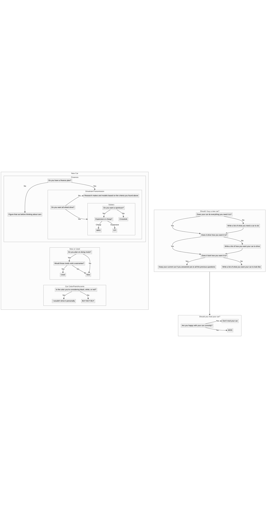
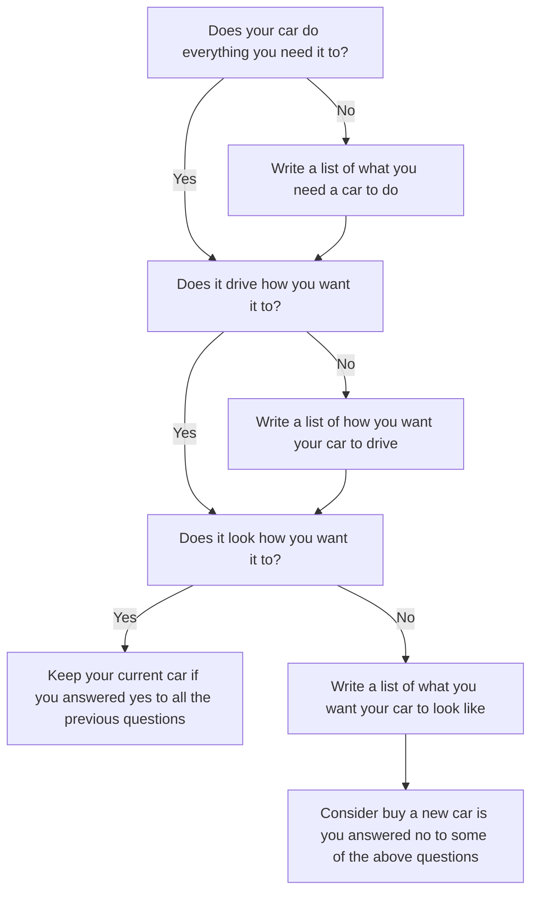
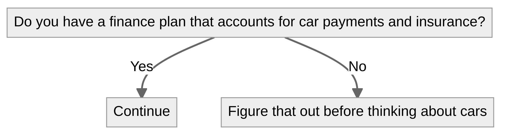
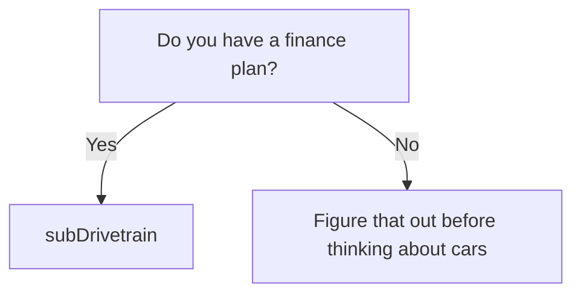

# To Car or Not to Car

## 1. Should you buy a new car?

<details>
    <summary>diagram source</summary>
    The following code block renders the above diagram using <a href="https://mermaid-js.github.io/mermaid/#/">Mermaid</a>.


</details>

## 2. Finances

<details>
    <summary>diagram source</summary>
    The following code block renders the above diagram using <a href="https://mermaid-js.github.io/mermaid/#/">Mermaid</a>.


</details>

```
flowchart TB
     subgraph subBuyingNewCar[New Car]
        subgraph subFinances[Finances]
        end

        subgraph subDrivetrain[Drivetrain/Transmission]
            awd[Do you want all wheel drive?]
                awd -->|Yes| subSubaru
                awd -->|No| noAwd[Research makes and models based on the criteria you found above]
        end

        subgraph subSubaru[Subaru]
            subaruSporty[Do you want a sportscar?]
                subaruSporty -->|Yes| subaruExpense[Expensive or cheap?]
                    subaruExpense -->|Cheap| WRX
                    subaruExpense -->|Expensive| STI
                subaruSporty -->|No| Crosstrek
        end

        subgraph subNewOrUsed[New or Used]
            willMod[Do you plan on doing mods?]
                willMod -->|Yes| voidWarrantee[Would those mods void a warrantee?]
                    voidWarrantee -->|Yes| Used
                    voidWarrantee -->|No| New
                willMod -->|No| New
        end

        subgraph subColor[Car Color/Paint/Accents]
            colorIsBoring[Is the color you're considering black, white, or red?]
                colorIsBoring -->|Yes| colorBoringAnswer[I wouldn't drive it personally]
                colorIsBoring -->|No| colorExcitingAnswer[BUY BUY BUY]
        end
    end

    subgraph subShouldMod[Should you mod your car?]
        modHappy[Are you happy with your car currently?]
            modHappy-->|Yes| noMods[Don't mod your car]
            modHappy-->|No| MOD
    end
```
