## Table of Contents
<!-- vim-markdown-toc GFM -->

* [1. Should you buy a new car?](#1-should-you-buy-a-new-car)
* [2. Finances](#2-finances)
* [3. Drivetrain](#3-drivetrain)
* [4. Subaru](#4-subaru)
* [5. Should you buy a new or used car](#5-should-you-buy-a-new-or-used-car)
* [6. What color for paint, accessories, wraps, etc.?](#6-what-color-for-paint-accessories-wraps-etc)
* [7. Should you mod your car?](#7-should-you-mod-your-car)

<!-- vim-markdown-toc -->

## 1. Should you buy a new car?

    
diagram source

    The following code block renders the above diagram using <a href="https://mermaid-js.github.io/mermaid/#/">Mermaid</a>.

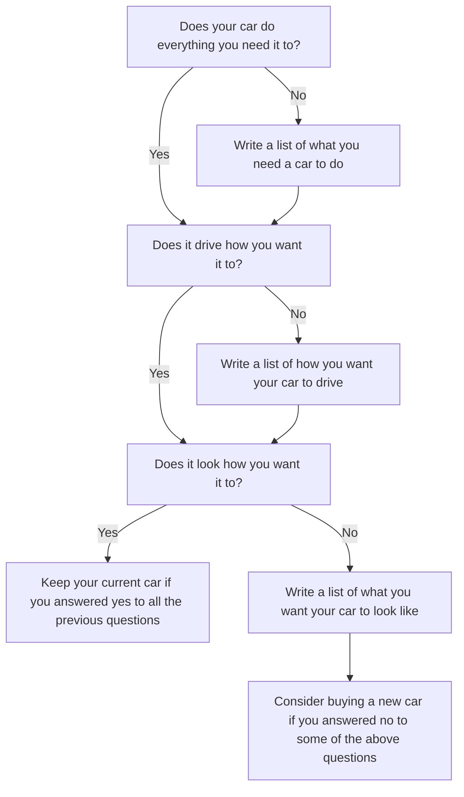

## 2. Finances

    
diagram source

    The following code block renders the above diagram using <a href="https://mermaid-js.github.io/mermaid/#/">Mermaid</a>.

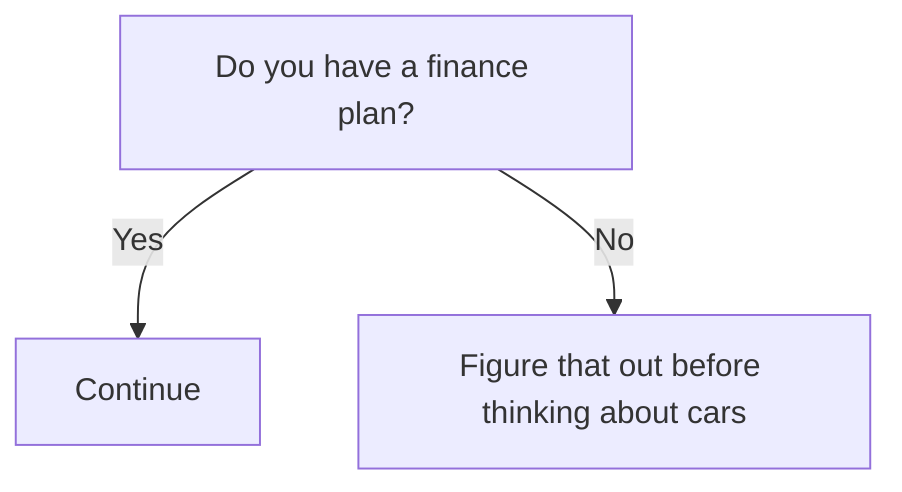

## 3. Drivetrain
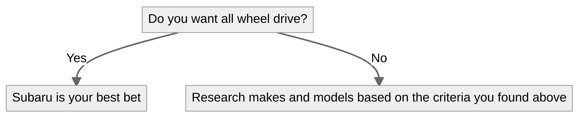

    
diagram source

    The following code block renders the above diagram using <a href="https://mermaid-js.github.io/mermaid/#/">Mermaid</a>.

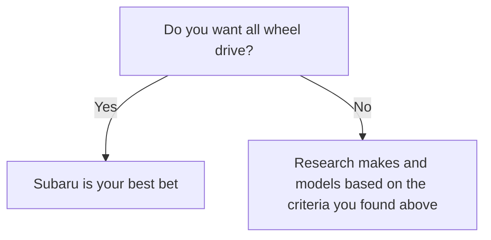

## 4. Subaru
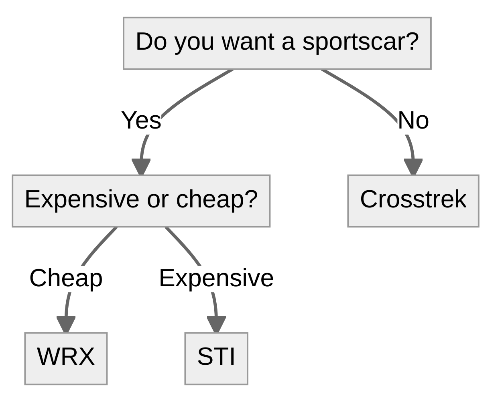

    
diagram source

    The following code block renders the above diagram using <a href="https://mermaid-js.github.io/mermaid/#/">Mermaid</a>.

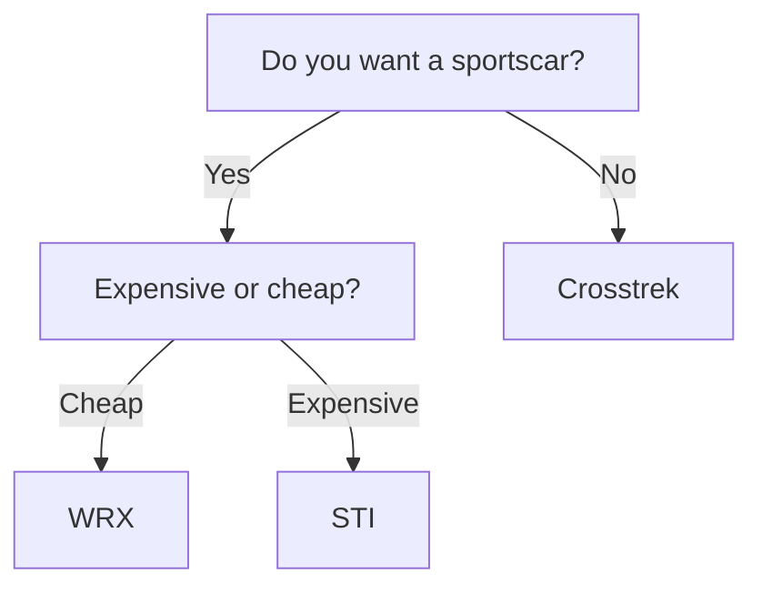

## 5. Should you buy a new or used car
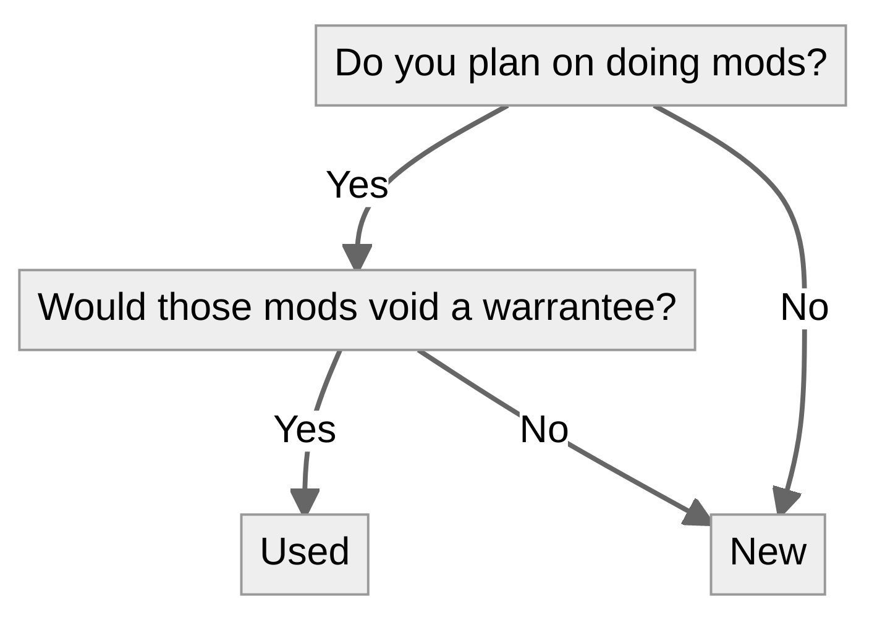

    
diagram source

    The following code block renders the above diagram using <a href="https://mermaid-js.github.io/mermaid/#/">Mermaid</a>.

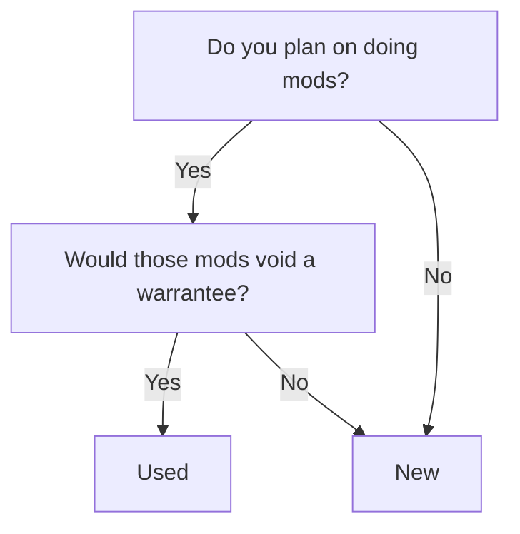

## 6. What color for paint, accessories, wraps, etc.?
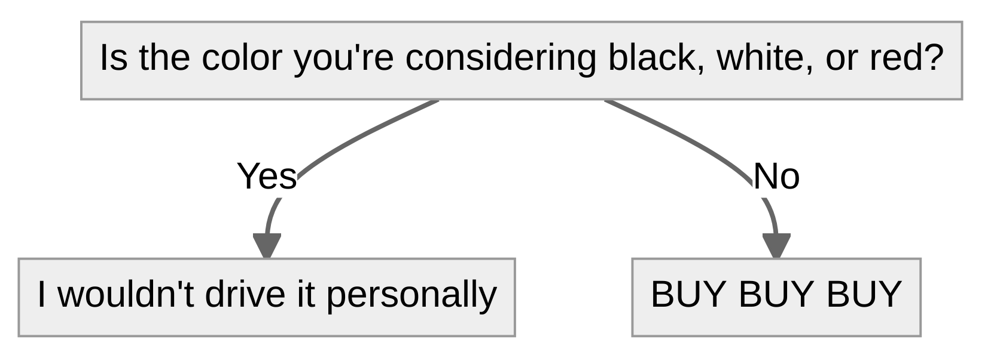

    
diagram source

    The following code block renders the above diagram using <a href="https://mermaid-js.github.io/mermaid/#/">Mermaid</a>.

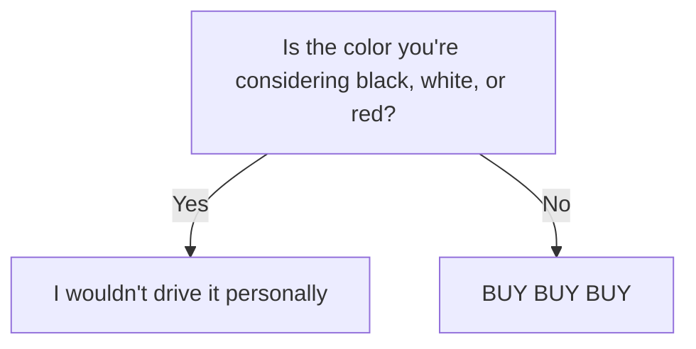

## 7. Should you mod your car?
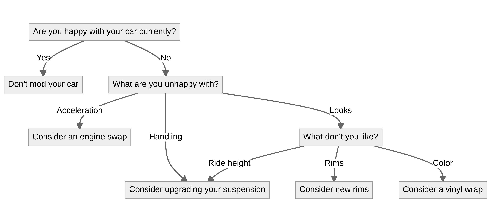

    
diagram source

    The following code block renders the above diagram using <a href="https://mermaid-js.github.io/mermaid/#/">Mermaid</a>.

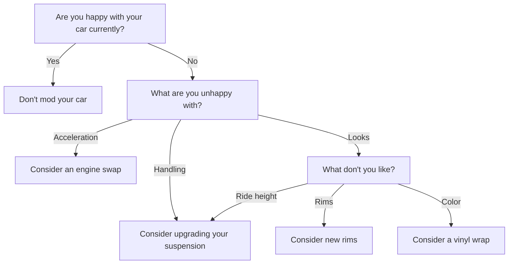

