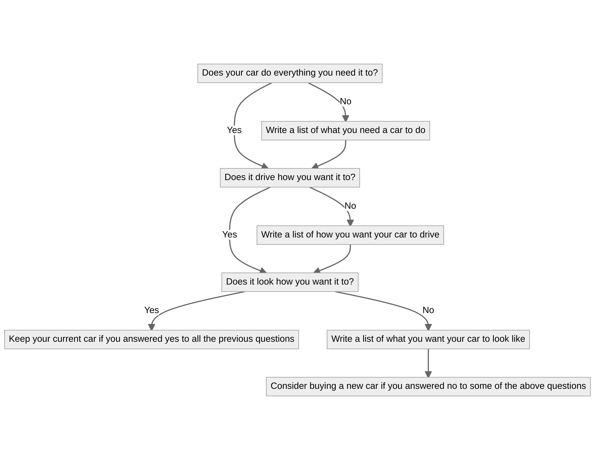

# To Car or Not to Car


<details>
<summary>diagram source</summary>
```mermaid
flowchart TB
    subgraph subNewCar[Should I buy a new car?]
        direction TB
        carNeeds[Does your car do everything you need it to?]
            carNeeds-->|Yes| carDriving
            carNeeds-->|No| carNeedsResearch[Write a list of what you need a car to do] -->carDriving
        carDriving[Does it drive how you want it to?]
            carDriving-->|Yes| carLooks
            carDriving-->|No| carDrivingResearch[Write a list of how you want your car to drive] -->carLooks
        carLooks[Does it look how you want it to?]
            carLooks-->|Yes| keepCurrentCar[Keep your current car if you answered yes to all the previous questions]
            carLooks-->|No| carLooksResearch[Write a list of what you want your car to look like]
    end

    subgraph subBuyingNewCar[New Car]
        subgraph subFinances[Finances]
            financePlan[Do you have a finance plan?]
                financePlan-->|Yes| subDrivetrain
                financePlan-->|No| noFinancePlan[Figure that out before thinking about cars]
        end

        subgraph subDrivetrain[Drivetrain/Transmission]
            awd[Do you want all wheel drive?]
                awd -->|Yes| subSubaru
                awd -->|No| noAwd[Research makes and models based on the criteria you found above]
        end

        subgraph subSubaru[Subaru]
            subaruSporty[Do you want a sportscar?]
                subaruSporty -->|Yes| subaruExpense[Expensive or cheap?]
                    subaruExpense -->|Cheap| WRX
                    subaruExpense -->|Expensive| STI
                subaruSporty -->|No| Crosstrek
        end

        subgraph subNewOrUsed[New or Used]
            willMod[Do you plan on doing mods?]
                willMod -->|Yes| voidWarrantee[Would those mods void a warrantee?]
                    voidWarrantee -->|Yes| Used
                    voidWarrantee -->|No| New
                willMod -->|No| New
        end

        subgraph subColor[Car Color/Paint/Accents]
            colorIsBoring[Is the color you're considering black, white, or red?]
                colorIsBoring -->|Yes| colorBoringAnswer[I wouldn't drive it personally]
                colorIsBoring -->|No| colorExcitingAnswer[BUY BUY BUY]
        end
    end

    subgraph subShouldMod[Should you mod your car?]
        modHappy[Are you happy with your car currently?]
            modHappy-->|Yes| noMods[Don't mod your car]
            modHappy-->|No| MOD
    end

    %% Describe the overall flow of the diagram
    subNewCar --> subShouldMod
    %%subNewCar --> subBuyingNewCar --> subFinances --> subNewOrUsed --> subColor --> subShouldMod
```
</details>

